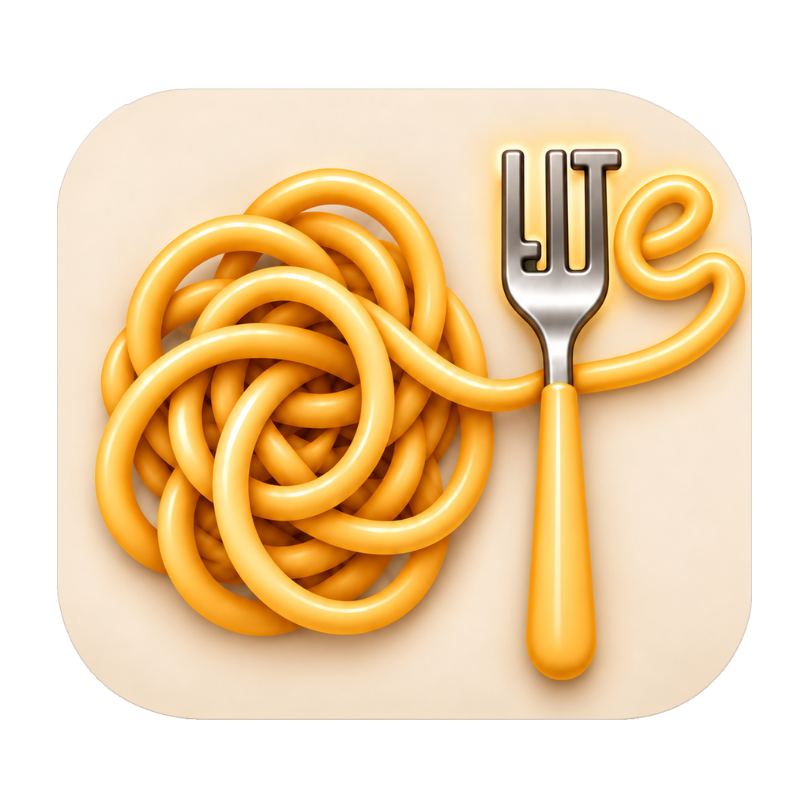
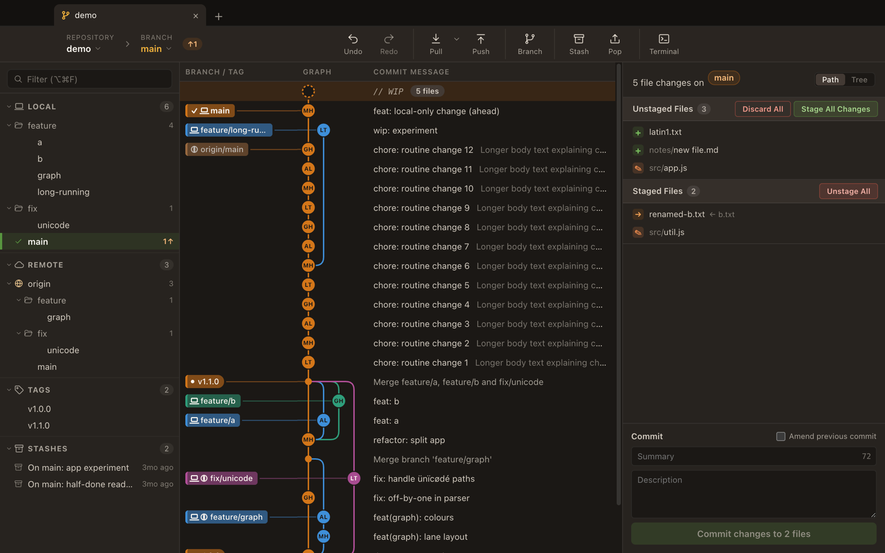
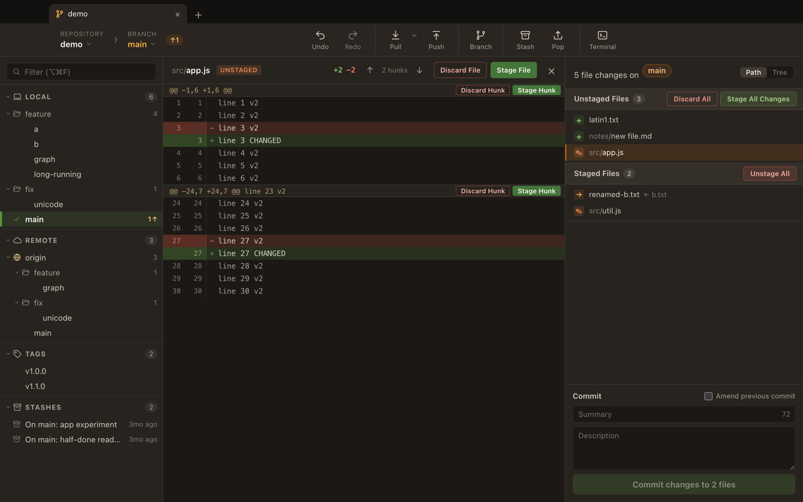
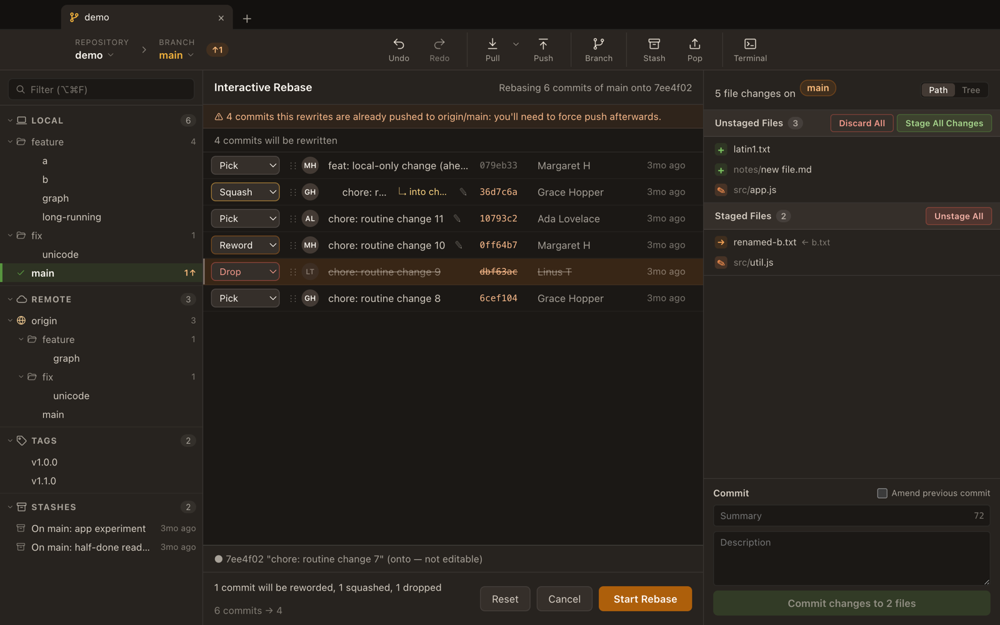

<p align="center">
  
</p>

<h1 align="center">Pasta Lite</h1>

<p align="center"><em>Untangle your history</em></p>

Pasta Lite is a minimal, graph-first desktop git client. The commit graph sits in the middle of the
window, with your branches on the left and your working changes on the right. It covers the everyday
workflow: stage, commit, branch, sync, stash, merge, rebase and undo. It's built on Electron and runs
your system `git`, so your existing SSH keys, credential helper and git config just work.

> **Status: alpha (0.1.0).** This is an early preview. There are no packaged builds yet, so you run it
> from source. Expect rough edges, and please report what you find.

## Screenshots







## Features

**Graph and history**
- Lane-based commit graph with branch and tag labels, merge and octopus-merge lines, and resizable, hideable columns.
- History loads in pages, so large repositories open quickly.
- Commit details with the changed files, as a path list or a tree, and each file's diff.
- Sidebar with local branches, remotes, tags and stashes, grouped into folders by prefix, with a filter box.

**Staging and committing**
- Stage, unstage and discard whole files, single hunks or selected lines.
- Commit, Commit All and amend, including a message-only amend.
- Discards are backed up, so they can be undone.

**Branches**
- Create, check out and delete branches, and check out remote branches as tracking branches.
- A branch switcher in the toolbar with a search field.
- Uncommitted changes that would block a checkout are stashed and re-applied for you.

**Remotes**
- Fetch (with prune and tags; a local tag that differs from the remote is kept and reported).
- Pull as fast-forward if possible, fast-forward only, or rebase. The chosen mode becomes the button's default.
- Push with an explicit refspec, set the upstream on the first push, and offer force-with-lease when a push is rejected.
- Cancel a running fetch, pull, push or rebase from the toolbar.

**Stash**
- Stash (untracked files included), apply, pop and drop, from the toolbar or the sidebar.

**Undo and redo**
- Undo and redo commits, checkouts, branch deletes and discards, driven by the HEAD reflog.

**Merge and rebase**
- Merge a branch into the current one, and rebase the current branch onto another branch or commit.
- Interactive rebase editor: pick, reword, edit, squash, fixup and drop, with drag-to-reorder. It warns you when the rewritten commits are already pushed.
- Uncommitted changes are autostashed and restored once the rebase or merge finishes or is aborted.
- Conflict helpers: a banner with Continue, Skip and Abort, resolve a file with ours or theirs, and mark all as resolved.

**Worktrees and bare repositories**
- Open linked worktrees and bare repositories. A bare repository shows its history and offers its worktrees.

**Tabs and repositories**
- One repository per tab, with reorderable tabs and tabs restored on the next launch.
- A repository picker (⌘P) that searches your recent repositories, plus File > Open Recent.
- Open the repository in your terminal.
- Keyboard shortcuts for the common actions: undo/redo, fetch, new branch, stage/unstage all, commit.

**Safety**
- Before opening a repository whose own git config runs commands (a filter driver, for example) or whose hooks folder has hooks git would run, Pasta Lite asks you to trust it first. The `ext::` transport is always blocked.
- The Electron renderers are sandboxed and context-isolated, with no Node access. Git runs only in the main process, which accepts only a fixed list of operations.

## Requirements

- **git 2.51 or newer.** Pasta Lite checks this at startup and won't run with an older git (undo depends on `git reflog write`).
- **Node.js 22.12 or newer**, to install and run it from source (Electron's installer needs it).
- **Platforms:** developed and tested on macOS. Windows and Linux are supported in the code but not yet tested.

## Getting started

```sh
git clone https://github.com/SilverClash/pasta-lite.git
cd pasta-lite
npm ci
npm start
```

To open a repository, you can:

- pass its path on the command line: `npm start -- /path/to/repo`
- use the repository picker on the start screen or in the toolbar (⌘P), or File > Open Recent
- use File > Open Repository… (⇧⌘O), or ⌘O to open a folder in the current tab

On Windows and Linux, use Ctrl in place of ⌘.

### Try it on a demo repository

`scripts/demo-repo.js` builds a throwaway repository with branches, merges, tags, a local bare `origin`,
stashes and a dirty working tree:

```sh
node scripts/demo-repo.js /tmp/pasta-demo
npm start -- /tmp/pasta-demo
```

It also creates `/tmp/pasta-demo.origin.git` next to it. The screenshots above were taken on this repository.

## Known limitations

- No clone or init. Open a repository that already exists.
- No credential or passphrase prompts. Git runs with `GIT_TERMINAL_PROMPT=0`, so use a credential helper or ssh-agent for remotes that need authentication.
- No cherry-pick, revert or reset.
- Tags are shown, but there's no UI for creating or deleting them.
- No renaming branches, deleting remote branches or managing remotes.
- No commit search, file history or blame.
- Dark theme only.
- No packaged builds yet.

## Development

```sh
npm test                      # the whole suite (about 9 minutes)
node --test test/git.test.js  # a single test file
```

The architecture, the project layout and the code conventions are described in
[CONTRIBUTING.md](CONTRIBUTING.md#architecture). Read it before opening a pull request. Changes are listed in
[CHANGELOG.md](CHANGELOG.md), and the [Code of Conduct](CODE_OF_CONDUCT.md) applies to everyone taking part.

## Security

To report a vulnerability, please follow [SECURITY.md](SECURITY.md) rather than opening a public issue.

## License

Apache License 2.0. See [LICENSE](LICENSE) and [NOTICE](NOTICE).

### Trademarks

"Pasta Lite" and its logo (the files in `assets/`) are trademarks of Alex and are not covered by the
Apache license. If you fork or redistribute the project, please use a different name and logo
unless you have permission. Using the name to refer to or describe the project is fine.
